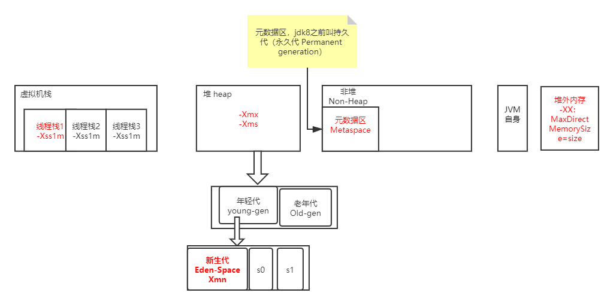

### JVM

JAVA 是一种面向对象、静态类型、编译执行，有虚拟机和垃圾收集和运行时、跨平台的高级语言

为什么可以跨平台：.java文件编译成 .class字节码文件，class是由单字节的指令组成（dup、astore），通过jvm虚拟机的类加载器加载 class文件，windows或linux系统下的虚拟机可以把class进行解释执行
三类加载器：
1. 启动类加载器（BootstrapClassLoader）
2. 扩展类加载器（ExtClassLoader）
3. 应用类加载器（AppClassLoader）
可以自定义ClassLoader，作用，class文件反编译

jvm内存，包含 栈，堆，非堆，jvm自身、直接内存（NIO）,栈包含n个线程栈，一个线程栈包含n个栈帧，一个帧是一个方法

### NIO

